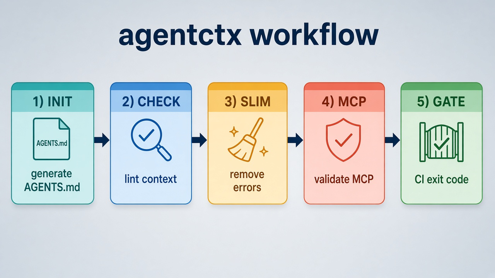
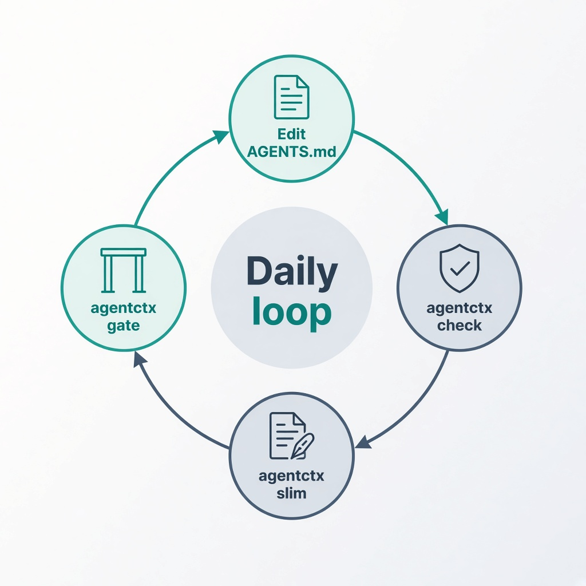

# agentctx

**The clear-workflow linter for AI agent context files and MCP configs.**

Lint `AGENTS.md`, `CLAUDE.md`, `GEMINI.md`, `.cursorrules`, and `.mcp.json`. Catch stale paths, dead commands, directory-tree bloat, and hardcoded secrets — then fix and gate in CI.

```bash
npx agentctx workflow   # see the loop
npx agentctx check
```

---

## Clear workflow



| Step | Command | Purpose |
|------|---------|---------|
| 1 | `agentctx init` | Generate a minimal context file from project metadata |
| 2 | `agentctx check` | Lint for stale refs, dead commands, trees, token waste |
| 3 | `agentctx slim <file>` | Remove error-severity content in place |
| 4 | `agentctx mcp` | Validate MCP server configs |
| 5 | `agentctx gate` | CI gate = `check` + `mcp` |



Print the same loop anytime:

```bash
agentctx workflow
```

See [WORKFLOW.md](./WORKFLOW.md) for the full guide.

---

## Web UI (FastAPI + Django)

Multi-page desks for scanning context files and MCP configs.

| Page | Path |
|------|------|
| Desk | `/` |
| Rules atlas | `/rules` |
| Live examples | `/examples` |
| MCP lab | `/mcp-lab` |
| Paste studio | `/studio` |
| About + init preview | `/about` |

```bash
python -m pip install -r requirements.txt
python -m uvicorn web.fastapi_app.main:app --reload --host 127.0.0.1 --port 8000
python web/django_app/manage.py runserver 8001
```

| Server | URL |
|--------|-----|
| FastAPI | http://127.0.0.1:8000 |
| Django | http://127.0.0.1:8001 |

API: `/api/check`, `/api/mcp`, `/api/gate`, `/api/rules`, `/docs`

---

## Install

```bash
npm install -g agentctx
# or
npx agentctx check
```

---

## Commands

### `check`

```bash
agentctx check [path] [--format terminal|json|sarif] [--severity info|warn|error] [--strict]
```

### `init`

```bash
agentctx init [path] [--format agents|claude|gemini|all] [--dry-run] [--force]
```

### `slim`

```bash
agentctx slim <file> [--dry-run] [--backup]
```

### `mcp`

```bash
agentctx mcp [path] [--format terminal|json]
```

### `gate`

```bash
agentctx gate [path] [--strict]
```

---

## What it checks

### Context rules

| Rule | Severity | Description |
|------|----------|-------------|
| `stale-file-ref` | error/warn | Paths that do not exist |
| `stale-command` | error | Scripts/targets missing from package.json / Makefile / Cargo / Go / Python |
| `no-directory-tree` | error | Embedded directory trees |
| `redundant-readme` | warn | High trigram overlap with README.md |
| `no-inferable-stack` | warn | Stack prose inferable from manifests |
| `max-lines` | warn/error | Files over 200 / 400 lines |
| `no-style-guide` | info | Style tips already enforced by tooling |
| `token-budget` | info/warn/error | Token estimate + signal-to-noise |
| `ci-coverage` | info | CI workflows not mentioned |

### MCP rules

| Rule | Severity | Description |
|------|----------|-------------|
| `mcp-schema` | error | Invalid / missing `mcpServers` |
| `mcp-missing-command` | error | No `command` or `url` |
| `mcp-hardcoded-secret` | error | Secrets in `env` |
| `mcp-localhost-url` | warn | Localhost-only URLs |
| `mcp-deprecated-transport` | warn | Deprecated SSE transport |
| `mcp-env-syntax` | warn | Wrong `${env:VAR}` syntax for VS Code |

---

## Configuration

`.agentctxrc.json`:

```json
{
  "checks": null,
  "ignore": ["no-style-guide"],
  "strict": false,
  "contextFiles": [],
  "tokenThresholds": {
    "info": 500,
    "warning": 2000,
    "error": 5000
  }
}
```

---

## CI

```yaml
- uses: actions/checkout@v4
- uses: actions/setup-node@v4
  with:
    node-version: '20'
- run: npm install
- run: npx agentctx gate --strict
```

SARIF upload example is in [WORKFLOW.md](./WORKFLOW.md).
